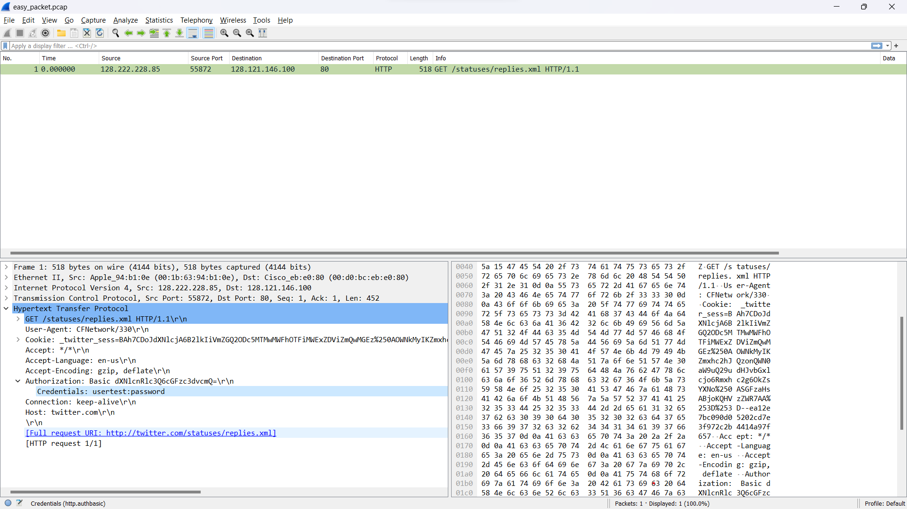
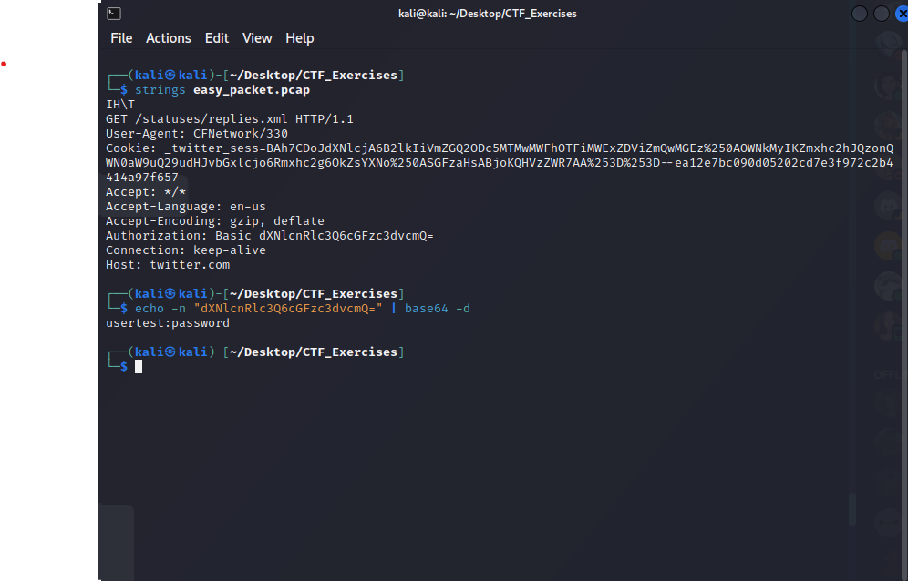

## This challenge was given by a mentor to train us for the upcoming Hack For Gov.

Task: Decode the secret word in the given pcap!

Looking directly at the pcap and inspecting the application layer using Wireshark,

  

- The secret word is already revealed: `usertest:password`.

Another option without using Wireshark is possible by executing the following commands:

  

`strings easy_packet.pcap`  allows us to see the strings in the pcap file. 
- Focusing on the authorization header, the value is encoded in a base-64 scheme. 

The value is decoded using the command `echo -n "dXNlcnRlc3Q6cGFzc3dvcmQ=" | base64 -n`.
- `echo -n` displays the output without the trailing new line
- Pipe the output of `echo` to `base64 -n` to finally decode the data.
