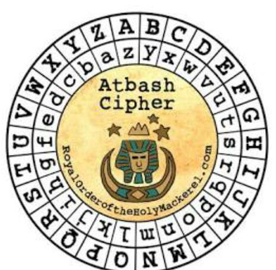

## This challenge was given by a mentor to train us for the upcoming Hack For Gov.

  

### Since an image is given, I used an online Steganographic Decoder https://futureboy.us/stegano/decinput.html
- Uploaded the image
- Select `view raw output as MIME-type text/plain`
- Submit query

Doing this will load a new tab that contains the decoded string from the image: `krxlXGU{zgyzhs_xizxp_92533667}`

Since the image said that it used Atbash cipher, I decided to use cyberchef and selected Atbash cipher as its recipe. 

Doing so will reveal the flag: `picoCTF{atbash_crack_92533667}`
