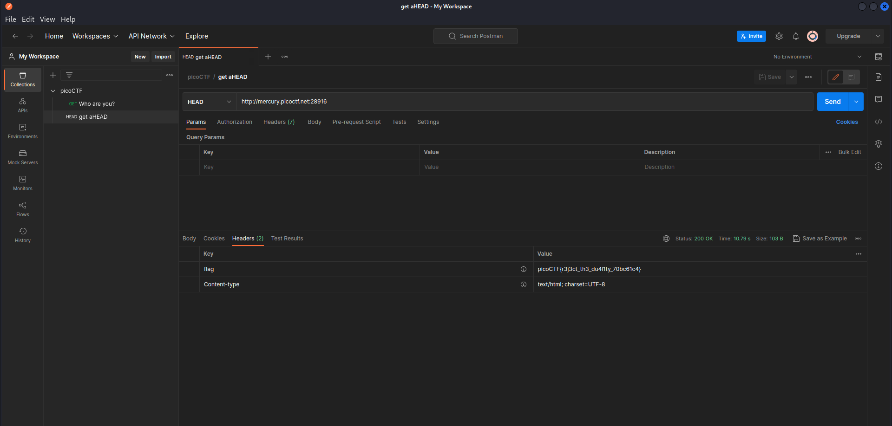

### Description 
- Find the flag being held on this server to get ahead of the competition http://mercury.picoctf.net:28916/

### Category 
- Web Exploitation 

### Approach 
- In Web Exploitation challenges, it is recommended that one uses Mozilla Firefox to open certain webpages because of its Web Developer Tools feature. 
- Entering the aforementioned url, I am greeted with two instructions. Choosing red will make the background of the webpage red and choosing blue will change the color
of the page accordingly. 
- There is no interesting information upon inspecting the Inspector, Style Editor, and Storage tabs of the webpage using the Web Developer Tools. 
- However, the name of the challenge is an HTTP method, specifically the HEAD method, not the GET. 
- `postman` gives us the ability to send customized http requests. Thus, I sent a HEAD request on the specified URL. In doing so, the flag is revealed in its header information tab.

  

### Flag 
- picoCTF{r3j3ct_th3_du4l1ty_70bc61c4}
