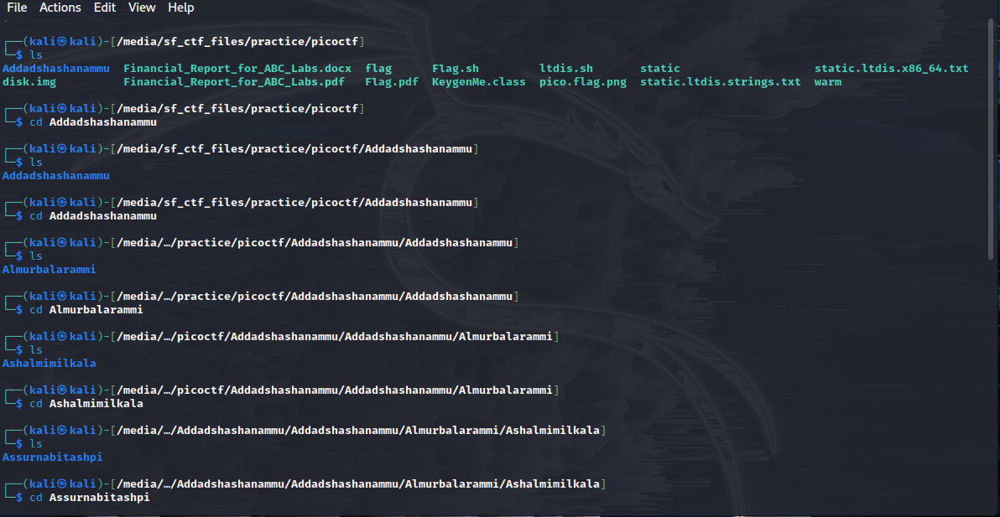
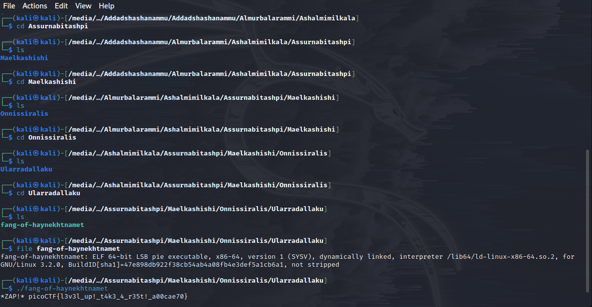

### Description
- Using tab complete in the Terminal will add years to your life, esp. when dealing with long rambling directory structures and filenames: <a href="Addadshashanammu.zip">Addadshashanammu.zip</a> 

### Category
- General Skills 

### Approach 
- As the title of the challenge suggests, using tab complete in the terminal is the key in finding the flag without losing your sanity 
from traversing the directories. 
- An executable file can be found at the final directory. Executing this reveals the flag.

  

  

### Flag 
- picoCTF{l3v3l_up!_t4k3_4_r35t!_a00cae70}
