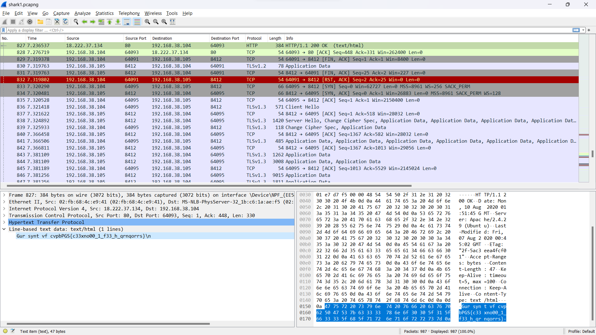

### Description 
- Can you find the flag? <a href="shark1.pcapng">shark1.pcapng.</a>.

### Category 
- Forensics 

### Approach 
- In a given packet capture file, one of its low hanging fruits is running it by `strings` and piping its output to find the flag in its specified format. However, doing 
this does not yet reveal the flag. 
- Another step that can be taken is to look at the exported objects in HTTP, specifically the objects with content type of `text/plain` or `text/html`. 
- There is only one object with a content-type of `text/html`. Upon further inspection of its associated packet, an interesting string can be found. 

- It looks like a rotation cipher. Thus, decoding it through a rotation cipher decoder online such as https://rot13.com, the flag is revealed. 

### Flag 
- picoCTF{p33kab00_1_s33_u_deadbeef}
