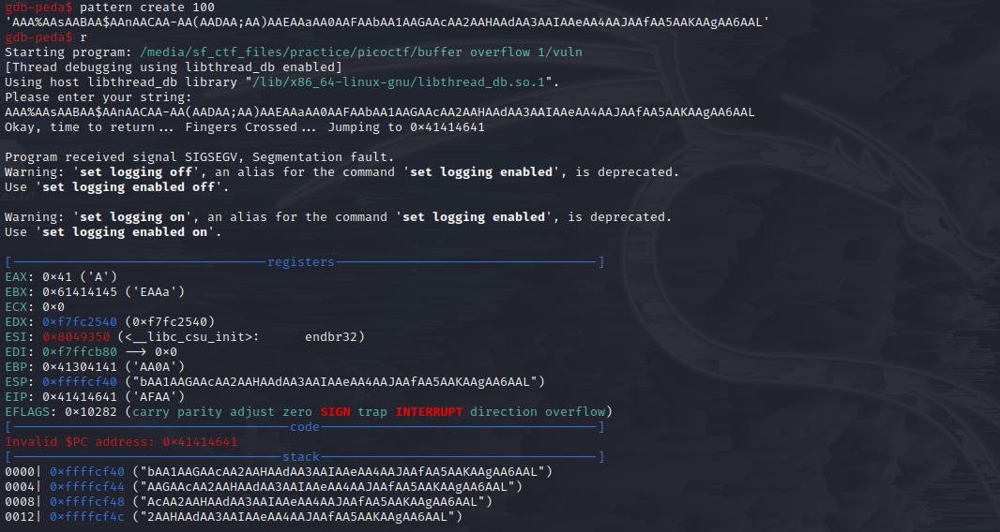
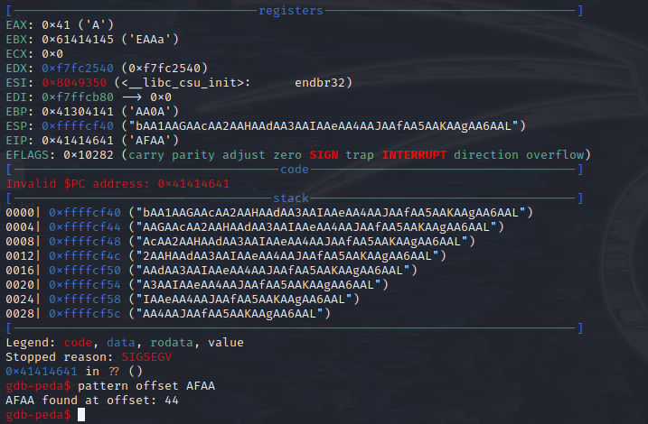
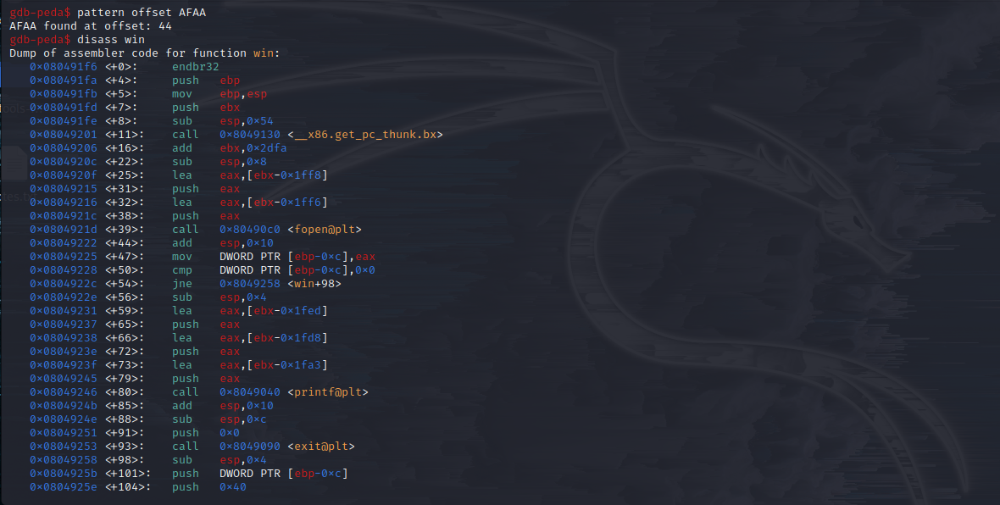
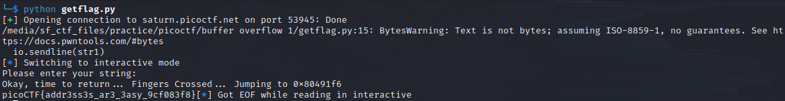

### Description 
- Control the return address. Additional details will be available after launching your challenge instance.

### Category 
- Binary Exploitation 

### Approach 
- I opted to utilize `gdb-peda` for this challenge which can be found here: https://github.com/longld/peda
- I used the command `pattern create 100` to generate an input string that can locate the address of where the <a href="vuln">program</a> will break. 

- From here, I found out that the program broke at the pattern where `AFAA` is associated. Thus, its offset can be determined by running the command `pattern offset AFAA`.

- In doing so, I found out that 44 bytes are need to overflow the buffer of the program. Hence, a padding of 44 A's will do. 
- Next, we have to find out the return address of the `win function` since there is no line on the <a href="vuln.c">source code</a> that will call it. This can be done 
by running the command `disass win`. 

- At this point, we now have all the information that we need to get the flag from the program. Running the <a href="getflag.py">python file</a> that I made was able to reveal the flag. 

### Flag 
- picoCTF{addr3ss3s_ar3_3asy_9cf083f8}

